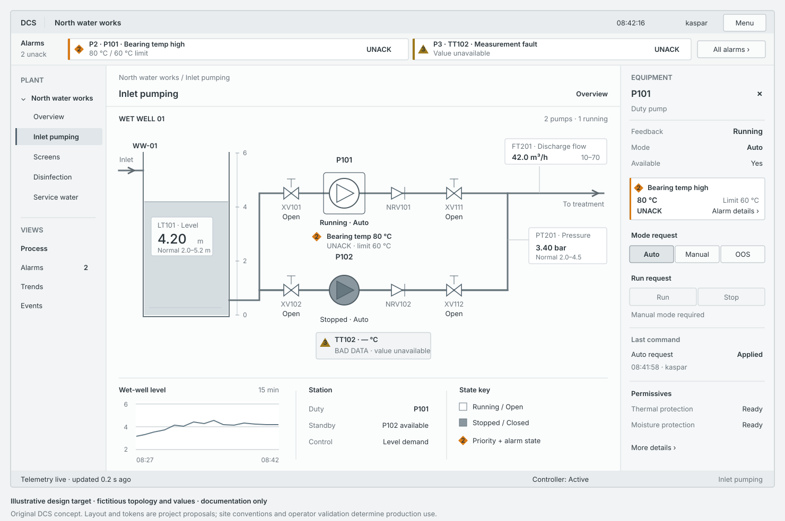

# Operator HMI presentation and visual references

- **Checked:** 2026-10-08.
- **Question:** How should the code-configured monitoring and control library look, and which illustrated references make that target concrete?
- **Affected requirements:** `WW-OPS-001`–`WW-OPS-003`, `WW-ALM-001`–`WW-ALM-002`.
- **Scope:** operator navigation, process graphics, equipment controls and alarm management. Reusable blocks are composed in plant code; a browser engineering editor is outside this brief. The appearance target below is a proposal, not an implemented feature or a conformity assessment.

## Standards and directly inspectable guidance

[ISA-101](https://www.isa.org/standards-and-publications/isa-standards/isa-standards-committees/isa101) addresses process-automation HMI design and its lifecycle. [IEC 62682:2022](https://webstore.iec.ch/en/publication/65543) and ISA-18.2 address alarm management, including presentation and operator response. [IEC 60073:2002](https://webstore.iec.ch/en/publication/587) covers indicator and actuator coding. [ISO 11064-5:2008](https://www.iso.org/standard/44691.html) covers control-centre displays and controls. [EEMUA 201, third edition](https://www.eemua.org/products/publications/digital/eemua-publication-201), is supporting control-room guidance, explicitly not a standard. Public publisher summaries establish their scope; the full normative clauses were not reviewed. These references do not establish product conformity or prescribe our exact CSS palette, sidebar position or alarm-card count.

The illustrated PAS and ABB publications below are non-normative vendor guidance. [HSE, *Control room design*](https://www.hse.gov.uk/comah/sragtech/techmeascontrol.htm), sections “Man Machine Interface”, “Coding techniques” and “Designing displays”, supports consistent readable labels, clear equipment/control relationships, redundant colour coding, and visible action results and delays. Its examples also distinguish numeric readings, analog indicators and trends by the information each conveys.

## Visual reference catalogue

These figures were inspected as rendered pages. Follow the source links to see the original illustrations; vendor images and the user-supplied screenshot are not redistributed here.

| Source and exact locator | Observed appearance | Proposed DCS use |
| --- | --- | --- |
| PAS, *High Performance Graphics to Maximize Operator Effectiveness*, v2.0, ©2012, [PDF p.17 / printed p.16, Fig.16](https://www.isa.org/getmedia/06130a38-f7af-4b35-8c9c-2c34f25c1977/The-High-Performance-HMI-Overview-v2-01.pdf#page=17), hosted by ISA | Plant overview groups measurements, ranges, trends and equipment state. It is not a complete piping diagram. | Give the overview a surveillance purpose; open an area for operation. |
| Same PAS publication, [PDF p.18 / printed p.17, Fig.17](https://www.isa.org/getmedia/06130a38-f7af-4b35-8c9c-2c34f25c1977/The-High-Performance-HMI-Overview-v2-01.pdf#page=18) | Area display combines process connections, nearby measurements and a reserved faceplate zone. | Make the area schematic the main workspace; selection keeps the process visible. |
| Same PAS publication, [PDF p.19 / printed p.18, Fig.18](https://www.isa.org/getmedia/06130a38-f7af-4b35-8c9c-2c34f25c1977/The-High-Performance-HMI-Overview-v2-01.pdf#page=19) | Equipment detail adds instruments, interlocks and trends. | Put causes and secondary readings in equipment detail. |
| Same PAS publication, [PDF p.11 / printed p.10, Fig.9](https://www.isa.org/getmedia/06130a38-f7af-4b35-8c9c-2c34f25c1977/The-High-Performance-HMI-Overview-v2-01.pdf#page=11) and [PDF p.12 / printed p.11, Figs.10–11](https://www.isa.org/getmedia/06130a38-f7af-4b35-8c9c-2c34f25c1977/The-High-Performance-HMI-Overview-v2-01.pdf#page=12) | Normal state uses brightness plus words. Separate alarm indicators combine priority colour, shape and text; response information opens on demand. | Preserve equipment state independently of its alarm badge. |
| ABB, *How a high performance HMI can lead to greater awareness, faster response and better decisions*, 8VZZ000576T0000, 02/2018, [p.7, Fig.4](https://library.e.abb.com/public/d62da22416d94dbf9b60a4dd3efc1471/8VZZ000576T0000_High_Performance_HMI_WP_v3.pdf#page=7) and [p.8, Fig.5](https://library.e.abb.com/public/d62da22416d94dbf9b60a4dd3efc1471/8VZZ000576T0000_High_Performance_HMI_WP_v3.pdf#page=8) | Restrained schematics retain connections and local readings. Analog indicators show normal bands and alarm limits separately. | Pair important values with declared operating context; a deviation is not automatically an alarm. |
| Siemens, supplied *Advanced Process Library V9.0*, German functional manual, 03/2017, [p.234, §2.2.1](s7jal90a_de-DE.pdf#page=234), pp.235–240 | Compact symbols have distinct regions for identity, state, alarms, quality and intervention indicators. | Define a common symbol anatomy rather than a generic status card. |
| Same supplied APL manual, [p.252, §2.3.1](s7jal90a_de-DE.pdf#page=252), pp.253, 255–256 | Clicking a symbol opens a faceplate. Shared headers and predictable operating, alarm, limit and trend views organize detail. | Share equipment identity and interaction conventions across block families. |
| Same supplied APL manual, [p.1126, §7.2.8.2](s7jal90a_de-DE.pdf#page=1126), pp.1128–1129, 1134; [p.1402, §7.10.8.2](s7jal90a_de-DE.pdf#page=1402), p.1410 | Motor and valve faceplates align mode, commands, feedback and inhibiting causes. Symbols have compact orientation variants. | Reuse the faceplate structure and code-configured symbol variants, with DCS semantics and original artwork. |

The APL locators refer to the supplied 2,514-page 2017 copy, not to whichever edition is currently offered by the Siemens support portal. It is a historical visual reference, not current safety policy. See also the existing [APL library behavior research](apl-reusable-library.md).

Kaspar's supplied “Separation” screenshot contributes the product brief: a narrow left area tree, a thin top alarm strip, a dominant connected schematic, nearby measurements and compact equipment details. Its origin and reuse rights are not established. This is direct user preference; the standards do not mandate that particular arrangement.

## Why the present demo still feels unfinished

The reviewed 2026-10-08 demo has working navigation, local alarm badges and receipted controls. Its main view still places two isolated pump symbols and large boxed measurements in a mostly empty canvas. It gives little sense of the process path or the relationship between equipment and readings. Untitled numeric navigation counts can also look like alarm counts, although they count configured symbols.

The two simulated pumps are independent loops. Connecting them cosmetically would misrepresent the running model. A convincing next example needs a declared, simulated process topology as well as better composition. Padding and colour adjustments alone cannot supply that missing context.

## Proposed appearance brief

**Original illustrative design target:** fictitious station, topology, values, history and limits; documentation only. This is not a screenshot of the running demo. Tank, valve, range and trend presentations illustrate the intended composition and do not claim current reusable-library coverage.

| Region | Primary content | Composition rule |
| --- | --- | --- |
| Top chrome | Plant/area breadcrumb and connection confidence | One compact row; avoid repeating the page title. Keep alarms visible when navigating. |
| Alarm strip | Configurable 2–4 highest-priority eligible unacknowledged alarms; priority, asset, short condition and lifecycle | Equal compact slots, ordered by the declared priority policy. A card opens that alarm in management; an equipment link locates its area. Show other configured warnings with explicit severity and ownership, not an alarm-like colour without meaning. |
| Left navigation | Areas and subareas, selected location, alarm rollups | Stable short labels. Label the meaning of every count; selection and alarm state use different cues. |
| Area schematic | Actual declared vessels, pumps, valves, connections and flow direction | One shared drawing surface. Align related devices; show junctions distinctly from crossings. Put labels and values beside their owner. Avoid a separate dashboard card around every symbol. |
| Measurement | Tag/name, process value, unit and quality; range or short trend where configured | Use aligned readouts with a common numeric style. Show configured normal bands and alarm limits separately. Missing limits/history remain absent or explicitly unavailable. |
| Selected equipment | Identity, actual state, mode, requested action, available controls, blocking cause and command result | Reserve a consistent right-hand faceplate. Keep alarm, limits, trend and diagnostics in predictable detail views. On narrow screens use a sheet/full detail view without reducing label size. |
| Alarm management | Priority, time, asset, condition and lifecycle; selected alarm response detail | Compact table for scanning. Place acknowledgment and supported managed-state actions beside the selected alarm, with required reason/duration and receipted results. Preserve a return path to its plant context. |

The proposed information hierarchy is **plant overview → area schematic → equipment detail**. The area view is the main control workspace requested by Kaspar. The overview summarizes areas and important deviations; equipment detail reveals causes, limits and diagnostics. This simplified DCS hierarchy does not claim to implement every level described by a source.

### Typography, density and visual language

Starting tokens for the next visual pass, chosen by DCS rather than prescribed by a standard: a 180–208 px navigation column, 280–340 px equipment faceplate, 40–48 px top chrome, and a 48–56 px desktop alarm strip. Use a 4/8/12 px spacing scale, 13–14 px primary labels and controls, 16 px section titles, and tabular numerals. Reserve 12 px for secondary metadata. Start equipment glyphs around 56–72 px and keep their associated tag/state readable at the intended display size. Validate at 1366×768 and 1600×900; these are layout starting points, not universal ergonomic limits.

Use a quiet light-grey process surface, dark readable text, limited borders, flat symbols and no decorative gradients or shadows. Bright/white running or open symbols and darker stopped or closed symbols also carry explicit state words. Do not animate normal flow or rotation. Selection uses a restrained outline separate from alarm coding.

The existing demo's P1 red, P2 orange and P3 amber are configurable product/site defaults, not universally mandated safety colours. Keep attention colour localized to priority markers and abnormal values, with priority text and a distinguishable shape. Active acknowledged alarms retain a steady indicator. Only eligible unacknowledged alarm indicators may pulse; reduced motion disables pulsing. Shelved/maintenance-managed alarms, stale data and bad quality retain explicit states. Do not imply that an alarm necessarily trips a pump: warning, protection and actual running feedback are separate declared behaviors.

### Reusable block composition

Each block needs a compact symbol plus a consistent control faceplate. Primary rows answer: **which equipment, what it is doing, who controls it, what can I command, and why is an action blocked?** Use short operator labels and show the relevant cause instead of a primary list of every Boolean signal. Put model identifiers and full diagnostics in expandable detail.

Use distinct compact qualifiers for simulated data, forced/substituted values and equipment maintenance or out-of-service status. These qualifiers must remain distinguishable from ordinary Stopped state, alarm priority and alarm-maintenance management; detail identifies the affected signal or equipment and its declared source.

Keep requested demand, controller output and sensed equipment feedback distinct. “Applied” means command settlement; it must not imply physical completion without feedback. Never draw an unknown or stale item as healthy. Configure symbols, bindings, labels, pipes, ranges and supported actions through the plant/library code. Show only declared capabilities; do not invent a normal band, trend history or process connection to fill space.

## Review criteria for the next implementation pass

Use a representative simulated area and a small set of manual visual checks; this research does not introduce another UI test suite.

- At the desktop sizes above, identify the process path, selected equipment, its state and nearby readings without opening diagnostics. Essential text remains readable and the faceplate does not cover the plant.
- Compare normal, unacknowledged, active acknowledged, managed and stale/bad-quality states. An alarm is visible both in its owning equipment and in the relevant navigation/management context; a warning does not falsely change Running to Fault.
- Exercise four populated alarm slots, alarm-to-management navigation, acknowledgment and return to the owning area. A short condition stays scannable; response guidance remains available in detail.
- Check the same screen in greyscale, reduced motion and keyboard navigation. On a phone, preserve readable labels and access to every alarm/control through scrolling or detail navigation.
- Read command availability and settlement together with actual feedback. A rejection, delay or missing signal must have a concrete visible explanation.

The next focus is one coherent area screen using the reusable blocks and a truthful simulated topology, followed by a review of its abnormal states. Exact density, vocabulary, palette, screen sizes and ranges remain assumptions for operator/site validation. These illustrations and checks establish a design target; they do not establish safety certification or customer acceptance.
